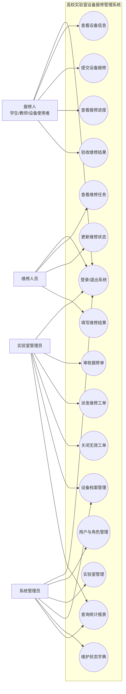
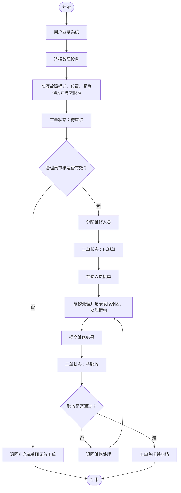
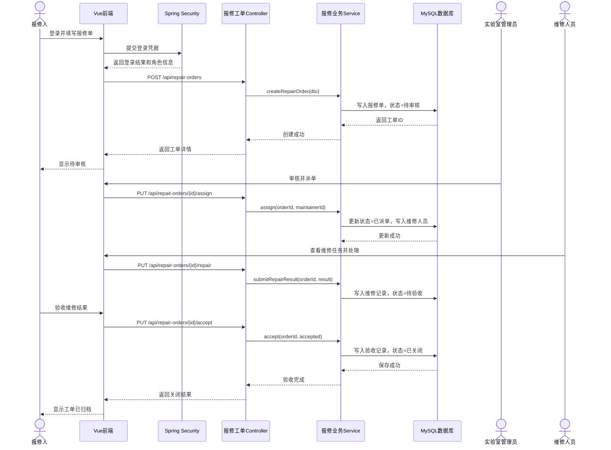
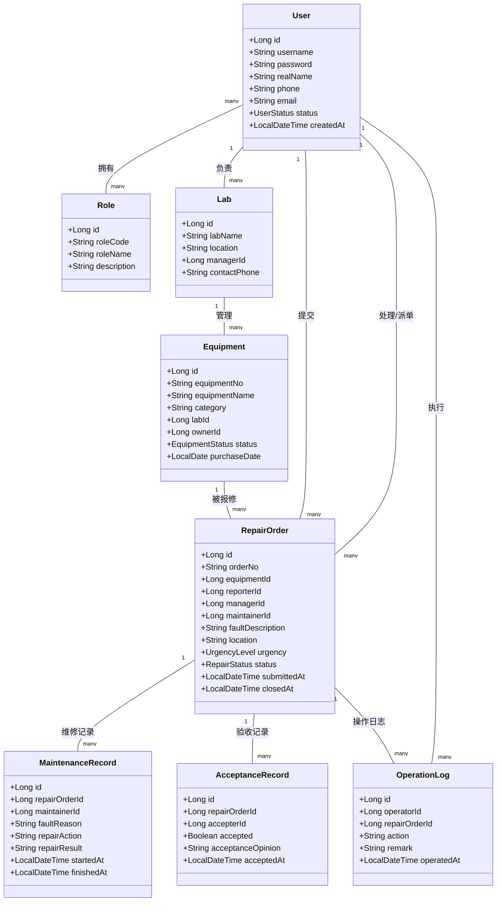
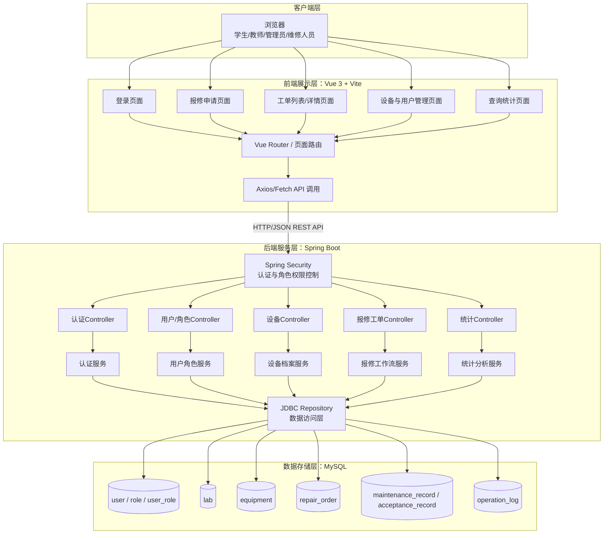
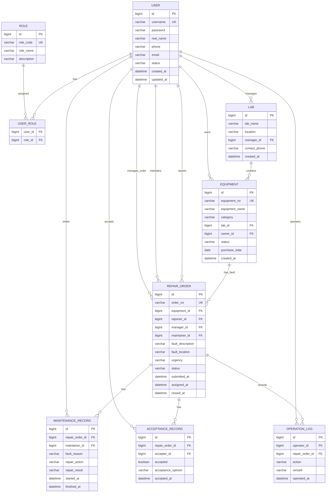

# 基于工作流的高校实验室设备报修管理系统图集

本文档用于项目需求分析、概要设计、详细设计和答辩展示，包含 UML 用例图、业务活动图、典型时序图、类图、系统架构图和 E-R 图。

## 1. UML 用例图

## 2. 报修业务活动图

## 3. 典型时序图：提交报修到验收关闭

## 4. UML 类图

## 5. 系统架构图

## 6. E-R 图

## 7. 数据表设计说明

| 表名 | 说明 |
|---|---|
| user | 保存系统用户，包括报修人、管理员、维修人员和系统管理员。 |
| role | 保存角色定义，如 REPORTER、LAB_ADMIN、MAINTAINER、SYS_ADMIN。 |
| user_role | 用户与角色多对多关联表。 |
| lab | 保存实验室基础信息及负责人。 |
| equipment | 保存实验室设备档案和当前状态。 |
| repair_order | 保存报修工单主表，记录当前状态和关键人员。 |
| maintenance_record | 保存维修处理过程、故障原因、处理措施和维修结果。 |
| acceptance_record | 保存验收结果、验收意见和验收时间。 |
| operation_log | 保存工单流转过程中的关键操作记录。 |

## 8. 工单状态建议

| 状态编码 | 状态名称 | 说明 |
|---|---|---|
| SUBMITTED | 待审核 | 报修人已提交，等待管理员审核。 |
| RETURNED | 已退回 | 管理员认为信息不足，退回报修人补充。 |
| ASSIGNED | 已派单 | 管理员已分配维修人员。 |
| REPAIRING | 维修中 | 维修人员已接单并处理中。 |
| WAIT_ACCEPTANCE | 待验收 | 维修人员已提交维修结果，等待验收。 |
| REWORK | 返修中 | 验收不通过，退回继续维修。 |
| CLOSED | 已关闭 | 验收通过并归档。 |
| CANCELED | 已取消 | 无效报修或人工取消。 |
